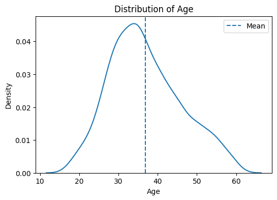
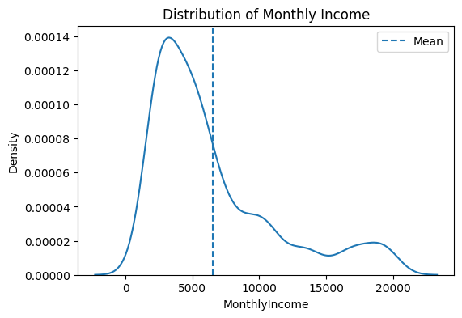
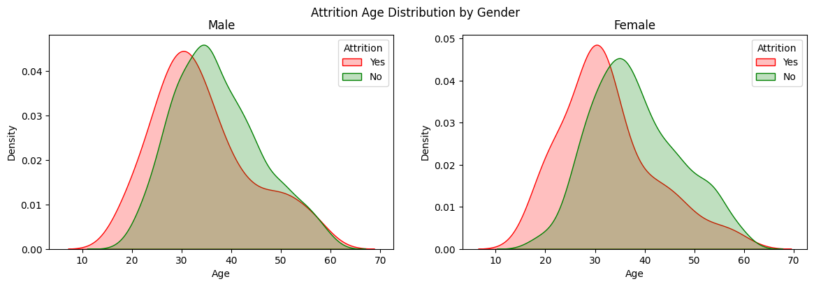
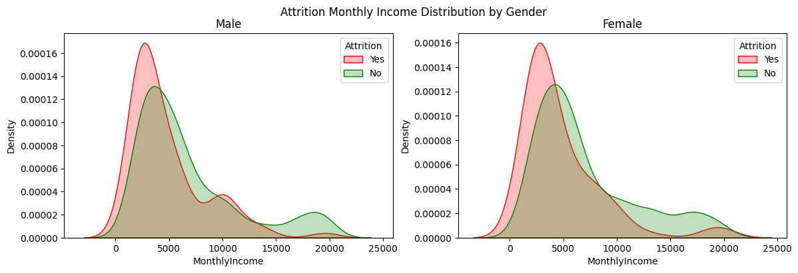

# IBM Employee Attrition Prediction

This paper's objective is to build a classification model that predicts employee attrition. The model will uncover factors that lead to attrition, such as "distance from home to workplace", "marital status", or "monthly income".

The topic is highly important because organizations are confronted with various challenges as a result of employee attrition, including:

*   Decreased productivity;
*   Loss of skilled employees;
*   To sum up, reduced profits.

Original dataset consists of fictional data and provided by IBM on [Kaggle](https://www.kaggle.com/datasets/pavansubhasht/ibm-hr-analytics-attrition-dataset).


```python
import pandas as pd
import numpy as np
import matplotlib.pyplot as plt
import seaborn as sns
```

## Data Overview

First examine data to better understand how to work with it throughout the paper.

Inspect next questions:

*   How many observations and variables in the dataset?
*   How many missing values?
*   What types of data are we dealing with?
*   What is the output variable and how to interpret it?
*   How balanced is the dataset?


```python
data = pd.read_csv("./input/ibm.csv")

data.head()
```


<div>
<style scoped>
    .dataframe tbody tr th:only-of-type {
        vertical-align: middle;
    }

    .dataframe tbody tr th {
        vertical-align: top;
    }

    .dataframe thead th {
        text-align: right;
    }
</style>
<table border="1" class="dataframe">
  <thead>
    <tr style="text-align: right;">
      <th></th>
      <th>Age</th>
      <th>Attrition</th>
      <th>BusinessTravel</th>
      <th>DailyRate</th>
      <th>Department</th>
      <th>DistanceFromHome</th>
      <th>Education</th>
      <th>EducationField</th>
      <th>EmployeeCount</th>
      <th>EmployeeNumber</th>
      <th>...</th>
      <th>RelationshipSatisfaction</th>
      <th>StandardHours</th>
      <th>StockOptionLevel</th>
      <th>TotalWorkingYears</th>
      <th>TrainingTimesLastYear</th>
      <th>WorkLifeBalance</th>
      <th>YearsAtCompany</th>
      <th>YearsInCurrentRole</th>
      <th>YearsSinceLastPromotion</th>
      <th>YearsWithCurrManager</th>
    </tr>
  </thead>
  <tbody>
    <tr>
      <th>0</th>
      <td>41</td>
      <td>Yes</td>
      <td>Travel_Rarely</td>
      <td>1102</td>
      <td>Sales</td>
      <td>1</td>
      <td>2</td>
      <td>Life Sciences</td>
      <td>1</td>
      <td>1</td>
      <td>...</td>
      <td>1</td>
      <td>80</td>
      <td>0</td>
      <td>8</td>
      <td>0</td>
      <td>1</td>
      <td>6</td>
      <td>4</td>
      <td>0</td>
      <td>5</td>
    </tr>
    <tr>
      <th>1</th>
      <td>49</td>
      <td>No</td>
      <td>Travel_Frequently</td>
      <td>279</td>
      <td>Research &amp; Development</td>
      <td>8</td>
      <td>1</td>
      <td>Life Sciences</td>
      <td>1</td>
      <td>2</td>
      <td>...</td>
      <td>4</td>
      <td>80</td>
      <td>1</td>
      <td>10</td>
      <td>3</td>
      <td>3</td>
      <td>10</td>
      <td>7</td>
      <td>1</td>
      <td>7</td>
    </tr>
    <tr>
      <th>2</th>
      <td>37</td>
      <td>Yes</td>
      <td>Travel_Rarely</td>
      <td>1373</td>
      <td>Research &amp; Development</td>
      <td>2</td>
      <td>2</td>
      <td>Other</td>
      <td>1</td>
      <td>4</td>
      <td>...</td>
      <td>2</td>
      <td>80</td>
      <td>0</td>
      <td>7</td>
      <td>3</td>
      <td>3</td>
      <td>0</td>
      <td>0</td>
      <td>0</td>
      <td>0</td>
    </tr>
    <tr>
      <th>3</th>
      <td>33</td>
      <td>No</td>
      <td>Travel_Frequently</td>
      <td>1392</td>
      <td>Research &amp; Development</td>
      <td>3</td>
      <td>4</td>
      <td>Life Sciences</td>
      <td>1</td>
      <td>5</td>
      <td>...</td>
      <td>3</td>
      <td>80</td>
      <td>0</td>
      <td>8</td>
      <td>3</td>
      <td>3</td>
      <td>8</td>
      <td>7</td>
      <td>3</td>
      <td>0</td>
    </tr>
    <tr>
      <th>4</th>
      <td>27</td>
      <td>No</td>
      <td>Travel_Rarely</td>
      <td>591</td>
      <td>Research &amp; Development</td>
      <td>2</td>
      <td>1</td>
      <td>Medical</td>
      <td>1</td>
      <td>7</td>
      <td>...</td>
      <td>4</td>
      <td>80</td>
      <td>1</td>
      <td>6</td>
      <td>3</td>
      <td>3</td>
      <td>2</td>
      <td>2</td>
      <td>2</td>
      <td>2</td>
    </tr>
  </tbody>
</table>
<p>5 rows × 35 columns</p>
</div>


Dataset includes **1470 observations** and **35 variables**:


```python
data.shape
```


    (1470, 35)


**No missing values**:


```python
data.isnull().sum()
```


    Age                         0
    Attrition                   0
    BusinessTravel              0
    DailyRate                   0
    Department                  0
    DistanceFromHome            0
    Education                   0
    EducationField              0
    EmployeeCount               0
    EmployeeNumber              0
    EnvironmentSatisfaction     0
    Gender                      0
    HourlyRate                  0
    JobInvolvement              0
    JobLevel                    0
    JobRole                     0
    JobSatisfaction             0
    MaritalStatus               0
    MonthlyIncome               0
    MonthlyRate                 0
    NumCompaniesWorked          0
    Over18                      0
    OverTime                    0
    PercentSalaryHike           0
    PerformanceRating           0
    RelationshipSatisfaction    0
    StandardHours               0
    StockOptionLevel            0
    TotalWorkingYears           0
    TrainingTimesLastYear       0
    WorkLifeBalance             0
    YearsAtCompany              0
    YearsInCurrentRole          0
    YearsSinceLastPromotion     0
    YearsWithCurrManager        0
    dtype: int64


There are **only categorical and integer** data types:


```python
data.info()
```

    <class 'pandas.core.frame.DataFrame'>
    RangeIndex: 1470 entries, 0 to 1469
    Data columns (total 35 columns):
     #   Column                    Non-Null Count  Dtype 
    ---  ------                    --------------  ----- 
     0   Age                       1470 non-null   int64 
     1   Attrition                 1470 non-null   object
     2   BusinessTravel            1470 non-null   object
     3   DailyRate                 1470 non-null   int64 
     4   Department                1470 non-null   object
     5   DistanceFromHome          1470 non-null   int64 
     6   Education                 1470 non-null   int64 
     7   EducationField            1470 non-null   object
     8   EmployeeCount             1470 non-null   int64 
     9   EmployeeNumber            1470 non-null   int64 
     10  EnvironmentSatisfaction   1470 non-null   int64 
     11  Gender                    1470 non-null   object
     12  HourlyRate                1470 non-null   int64 
     13  JobInvolvement            1470 non-null   int64 
     14  JobLevel                  1470 non-null   int64 
     15  JobRole                   1470 non-null   object
     16  JobSatisfaction           1470 non-null   int64 
     17  MaritalStatus             1470 non-null   object
     18  MonthlyIncome             1470 non-null   int64 
     19  MonthlyRate               1470 non-null   int64 
     20  NumCompaniesWorked        1470 non-null   int64 
     21  Over18                    1470 non-null   object
     22  OverTime                  1470 non-null   object
     23  PercentSalaryHike         1470 non-null   int64 
     24  PerformanceRating         1470 non-null   int64 
     25  RelationshipSatisfaction  1470 non-null   int64 
     26  StandardHours             1470 non-null   int64 
     27  StockOptionLevel          1470 non-null   int64 
     28  TotalWorkingYears         1470 non-null   int64 
     29  TrainingTimesLastYear     1470 non-null   int64 
     30  WorkLifeBalance           1470 non-null   int64 
     31  YearsAtCompany            1470 non-null   int64 
     32  YearsInCurrentRole        1470 non-null   int64 
     33  YearsSinceLastPromotion   1470 non-null   int64 
     34  YearsWithCurrManager      1470 non-null   int64 
    dtypes: int64(26), object(9)
    memory usage: 402.1+ KB
    

**Attrition is a target variable** indicating that an employee has left a job.

Moreover, the dataset is highly **imbalanced**:


```python
data["Attrition"].value_counts()
```


    Attrition
    No     1233
    Yes     237
    Name: count, dtype: int64


## Data Analysis

Need to carefully study the dataset to find patterns and detect outliers.


```python
data.describe()
```


<div>
<style scoped>
    .dataframe tbody tr th:only-of-type {
        vertical-align: middle;
    }

    .dataframe tbody tr th {
        vertical-align: top;
    }

    .dataframe thead th {
        text-align: right;
    }
</style>
<table border="1" class="dataframe">
  <thead>
    <tr style="text-align: right;">
      <th></th>
      <th>Age</th>
      <th>DailyRate</th>
      <th>DistanceFromHome</th>
      <th>Education</th>
      <th>EmployeeCount</th>
      <th>EmployeeNumber</th>
      <th>EnvironmentSatisfaction</th>
      <th>HourlyRate</th>
      <th>JobInvolvement</th>
      <th>JobLevel</th>
      <th>...</th>
      <th>RelationshipSatisfaction</th>
      <th>StandardHours</th>
      <th>StockOptionLevel</th>
      <th>TotalWorkingYears</th>
      <th>TrainingTimesLastYear</th>
      <th>WorkLifeBalance</th>
      <th>YearsAtCompany</th>
      <th>YearsInCurrentRole</th>
      <th>YearsSinceLastPromotion</th>
      <th>YearsWithCurrManager</th>
    </tr>
  </thead>
  <tbody>
    <tr>
      <th>count</th>
      <td>1470.000000</td>
      <td>1470.000000</td>
      <td>1470.000000</td>
      <td>1470.000000</td>
      <td>1470.0</td>
      <td>1470.000000</td>
      <td>1470.000000</td>
      <td>1470.000000</td>
      <td>1470.000000</td>
      <td>1470.000000</td>
      <td>...</td>
      <td>1470.000000</td>
      <td>1470.0</td>
      <td>1470.000000</td>
      <td>1470.000000</td>
      <td>1470.000000</td>
      <td>1470.000000</td>
      <td>1470.000000</td>
      <td>1470.000000</td>
      <td>1470.000000</td>
      <td>1470.000000</td>
    </tr>
    <tr>
      <th>mean</th>
      <td>36.923810</td>
      <td>802.485714</td>
      <td>9.192517</td>
      <td>2.912925</td>
      <td>1.0</td>
      <td>1024.865306</td>
      <td>2.721769</td>
      <td>65.891156</td>
      <td>2.729932</td>
      <td>2.063946</td>
      <td>...</td>
      <td>2.712245</td>
      <td>80.0</td>
      <td>0.793878</td>
      <td>11.279592</td>
      <td>2.799320</td>
      <td>2.761224</td>
      <td>7.008163</td>
      <td>4.229252</td>
      <td>2.187755</td>
      <td>4.123129</td>
    </tr>
    <tr>
      <th>std</th>
      <td>9.135373</td>
      <td>403.509100</td>
      <td>8.106864</td>
      <td>1.024165</td>
      <td>0.0</td>
      <td>602.024335</td>
      <td>1.093082</td>
      <td>20.329428</td>
      <td>0.711561</td>
      <td>1.106940</td>
      <td>...</td>
      <td>1.081209</td>
      <td>0.0</td>
      <td>0.852077</td>
      <td>7.780782</td>
      <td>1.289271</td>
      <td>0.706476</td>
      <td>6.126525</td>
      <td>3.623137</td>
      <td>3.222430</td>
      <td>3.568136</td>
    </tr>
    <tr>
      <th>min</th>
      <td>18.000000</td>
      <td>102.000000</td>
      <td>1.000000</td>
      <td>1.000000</td>
      <td>1.0</td>
      <td>1.000000</td>
      <td>1.000000</td>
      <td>30.000000</td>
      <td>1.000000</td>
      <td>1.000000</td>
      <td>...</td>
      <td>1.000000</td>
      <td>80.0</td>
      <td>0.000000</td>
      <td>0.000000</td>
      <td>0.000000</td>
      <td>1.000000</td>
      <td>0.000000</td>
      <td>0.000000</td>
      <td>0.000000</td>
      <td>0.000000</td>
    </tr>
    <tr>
      <th>25%</th>
      <td>30.000000</td>
      <td>465.000000</td>
      <td>2.000000</td>
      <td>2.000000</td>
      <td>1.0</td>
      <td>491.250000</td>
      <td>2.000000</td>
      <td>48.000000</td>
      <td>2.000000</td>
      <td>1.000000</td>
      <td>...</td>
      <td>2.000000</td>
      <td>80.0</td>
      <td>0.000000</td>
      <td>6.000000</td>
      <td>2.000000</td>
      <td>2.000000</td>
      <td>3.000000</td>
      <td>2.000000</td>
      <td>0.000000</td>
      <td>2.000000</td>
    </tr>
    <tr>
      <th>50%</th>
      <td>36.000000</td>
      <td>802.000000</td>
      <td>7.000000</td>
      <td>3.000000</td>
      <td>1.0</td>
      <td>1020.500000</td>
      <td>3.000000</td>
      <td>66.000000</td>
      <td>3.000000</td>
      <td>2.000000</td>
      <td>...</td>
      <td>3.000000</td>
      <td>80.0</td>
      <td>1.000000</td>
      <td>10.000000</td>
      <td>3.000000</td>
      <td>3.000000</td>
      <td>5.000000</td>
      <td>3.000000</td>
      <td>1.000000</td>
      <td>3.000000</td>
    </tr>
    <tr>
      <th>75%</th>
      <td>43.000000</td>
      <td>1157.000000</td>
      <td>14.000000</td>
      <td>4.000000</td>
      <td>1.0</td>
      <td>1555.750000</td>
      <td>4.000000</td>
      <td>83.750000</td>
      <td>3.000000</td>
      <td>3.000000</td>
      <td>...</td>
      <td>4.000000</td>
      <td>80.0</td>
      <td>1.000000</td>
      <td>15.000000</td>
      <td>3.000000</td>
      <td>3.000000</td>
      <td>9.000000</td>
      <td>7.000000</td>
      <td>3.000000</td>
      <td>7.000000</td>
    </tr>
    <tr>
      <th>max</th>
      <td>60.000000</td>
      <td>1499.000000</td>
      <td>29.000000</td>
      <td>5.000000</td>
      <td>1.0</td>
      <td>2068.000000</td>
      <td>4.000000</td>
      <td>100.000000</td>
      <td>4.000000</td>
      <td>5.000000</td>
      <td>...</td>
      <td>4.000000</td>
      <td>80.0</td>
      <td>3.000000</td>
      <td>40.000000</td>
      <td>6.000000</td>
      <td>4.000000</td>
      <td>40.000000</td>
      <td>18.000000</td>
      <td>15.000000</td>
      <td>17.000000</td>
    </tr>
  </tbody>
</table>
<p>8 rows × 26 columns</p>
</div>


Counting unique values:


```python
data.nunique()
```


    Age                           43
    Attrition                      2
    BusinessTravel                 3
    DailyRate                    886
    Department                     3
    DistanceFromHome              29
    Education                      5
    EducationField                 6
    EmployeeCount                  1
    EmployeeNumber              1470
    EnvironmentSatisfaction        4
    Gender                         2
    HourlyRate                    71
    JobInvolvement                 4
    JobLevel                       5
    JobRole                        9
    JobSatisfaction                4
    MaritalStatus                  3
    MonthlyIncome               1349
    MonthlyRate                 1427
    NumCompaniesWorked            10
    Over18                         1
    OverTime                       2
    PercentSalaryHike             15
    PerformanceRating              2
    RelationshipSatisfaction       4
    StandardHours                  1
    StockOptionLevel               4
    TotalWorkingYears             40
    TrainingTimesLastYear          7
    WorkLifeBalance                4
    YearsAtCompany                37
    YearsInCurrentRole            19
    YearsSinceLastPromotion       16
    YearsWithCurrManager          18
    dtype: int64


"EmployeeCount", "Over18", "StandardHours" have only one unique values; "EmployeeNumber" has 1470 ones. So this features are useless and should be dropped:


```python
data.drop(["EmployeeCount", "EmployeeNumber", "Over18", "StandardHours"], axis="columns", inplace=True)
```

Age range in the dataset is between 18 and 60 with 37 years as mean:


```python
plt.figure(figsize=(6,4))
sns.kdeplot(x=data["Age"])
plt.axvline(x=data["Age"].mean(), linestyle ="--", label="Mean")
plt.legend()
plt.title("Distribution of Age")
plt.show()
```


    

    


Mean monthly salary is about 6500$:


```python
plt.figure(figsize=(6,4))
sns.kdeplot(x=data["MonthlyIncome"])
plt.axvline(x=data["MonthlyIncome"].mean(), linestyle ="--", label="Mean")
plt.legend()
plt.title("Distribution of Monthly Income")
plt.show()
```


    

    


```python
fig, axes = plt.subplots(1, 2, sharex=True, figsize=(14,4))
fig.suptitle("Attrition Age Distribution by Gender")
sns.kdeplot(ax=axes[0],x=data[(data["Gender"]=="Male")&(data["Attrition"]=="Yes")]["Age"], color="r", fill=True, label="Yes")
sns.kdeplot(ax=axes[0],x=data[(data["Gender"]=="Male")&(data["Attrition"]=="No")]["Age"], color="g", fill=True, label="No")
axes[0].set_title("Male")
axes[0].legend(title="Attrition")
sns.kdeplot(ax=axes[1],x=data[(data["Gender"]=="Female")&(data["Attrition"]=="Yes")]["Age"], color="r", fill=True, label="Yes")
sns.kdeplot(ax=axes[1],x=data[(data["Gender"]=="Female")&(data["Attrition"]=="No")]["Age"], color="g", fill=True, label="No")
axes[1].set_title("Female")
axes[1].legend(title="Attrition")
plt.show()
```


    

    


```python
fig, axes = plt.subplots(1, 2, sharex=True, figsize=(14,4))
fig.suptitle("Attrition Monthly Income Distribution by Gender")
sns.kdeplot(ax=axes[0],x=data[(data["Gender"]=="Male")&(data["Attrition"]=="Yes")]["MonthlyIncome"], color="r", fill=True, label="Yes")
sns.kdeplot(ax=axes[0],x=data[(data["Gender"]=="Male")&(data["Attrition"]=="No")]["MonthlyIncome"], color="g", fill=True, label="No")
axes[0].set_title("Male")
axes[0].legend(title="Attrition")
sns.kdeplot(ax=axes[1],x=data[(data["Gender"]=="Female")&(data["Attrition"]=="Yes")]["MonthlyIncome"], color="r", fill=True, label="Yes")
sns.kdeplot(ax=axes[1],x=data[(data["Gender"]=="Female")&(data["Attrition"]=="No")]["MonthlyIncome"], color="g", fill=True, label="No")
axes[1].set_title("Female")
axes[1].legend(title="Attrition")
plt.show()
```


    

    


## Data Preprocessing

*To be continued...*
